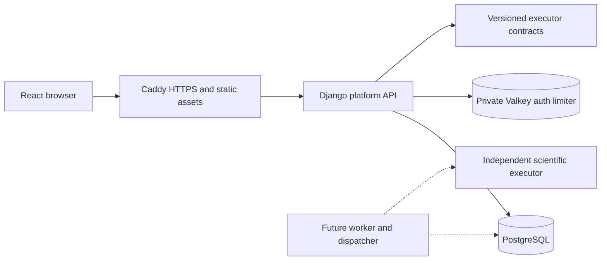

# Platform architecture

The user explicitly chose standard engineering practices without BMAD. This document fixes shared architectural constraints; it is not a dependency on any methodology runtime or agent bundle.

## Design Paradigm

React is a static application. Django owns accounts, workspaces, projects and transactional domain services. HTTP serializers/views call those services; ORM access remains scoped by current authorization. Avoid a universal repository abstraction or configurable permissions engine.

## Invariants & Rules

### AD-1 — Fresh non-scientific foundation [ADOPTED]
- **Binds:** all
- **Prevents:** legacy scientific dependencies or copying prototype complexity into the new core
- **Rule:** the platform image has no scientific engine dependencies. Old source is preserved, not migrated. Files, jobs, charges and server purchases are outside this executable slice.

### AD-2 — One authoritative tenant and current authorization [ADOPTED]
- **Binds:** users, workspaces, projects, frontend caches
- **Prevents:** cross-tenant disclosure, implicit organizational access and stale permissions
- **Rule:** projects have exactly one immutable workspace. Active membership plus a project grant/ownership is required. All list/read/mutation/export paths use the same scoped policy. Organization owner is an administrative role, not an implicit content reader. Cache keys contain identity/workspace context and caches clear on sign-out/workspace changes.

### AD-3 — Revocation and ownership recovery [ADOPTED]
- **Binds:** memberships, project ownership, audit
- **Prevents:** blocking security removal or reviving old grants on rejoin
- **Rule:** revocation commits immediately and never reactivates the same membership. Orphan projects are read-only. Organization recovery requires active workspace ownership, recent authentication, an active target member, reason and atomic audit. Never recover personal projects via organization authority. Preserve organization records on user deactivation.

### AD-4 — Identity, transaction and mutation ownership [ADOPTED]
- **Binds:** backend, migrations, frontend mutations
- **Prevents:** parallel identity systems, lost updates and non-atomic policy changes
- **Rule:** a custom user model exists in migration one. allauth owns identity/security flows, with same-origin cookies and CSRF. Organization owners/operators require MFA. Explicit application services own authorization-sensitive writes and audit together. Project mutations require the expected version; conflicts preserve client edits.

### AD-5 — Confidentiality across boundaries [ADOPTED]
- **Binds:** logs, audit, notifications, storage, science contracts
- **Prevents:** leaking research inputs, titles or filenames through incidental channels
- **Rule:** no scientific/user payloads in logs, metrics, email or payment metadata. Private responses are not publicly cached. No public sharing in v1. Later finalized files use opaque immutable keys, authorized API access and a separate read-only final-artifact mount; scratch is separate and symlinks/non-regular files cannot be promoted. Development/CI use synthetic data.

### AD-6 — Stable execution and financial authority [ADOPTED]
- **Binds:** future jobs, quota, billing, executor seam
- **Prevents:** mutable admitted input, lost dispatch or duplicate settlement
- **Rule:** an admitted run freezes input/files, capability and pricing version. PostgreSQL atomically records admission, finite cost reservation and outbox intent. Delivery is at least once; current-attempt fencing and unique settlement make accepted result/charge once-only. Cancellation and success race under the same transaction authority. Only successful accepted computation settles; failed/cancelled work releases reservations. Broker/cache are not financial truth.

### AD-7 — Isolated environment and honest operations [ADOPTED]
- **Binds:** bootstrap, Compose, CI, release
- **Prevents:** host toolchain contamination, destructive cleanup and unsupported readiness claims
- **Rule:** toolchains live in containers; Docker/Compose are host prerequisites. Namespace project resources, preserve state on repeated bootstrap, and never globally prune. Healthcheck is not automatic restart: distinguish readiness from liveness. Public release requires external backups/restore, actual server load evidence and configured external providers. One VPS has no automatic whole-host failover.

## Consistency Conventions

| Concern | Convention |
| --- | --- |
| IDs and time | UUID identifiers; timezone-aware UTC timestamps |
| API | `/api/v1/`, trailing slashes, OpenAPI-generated frontend types; allauth keeps its own standard browser contract |
| Pagination | Paginate project/member/audit lists; never return an unbounded project catalogue |
| Mutation | Transactional services, explicit expected project version; no implicit client retry of non-idempotent writes |
| Secrets | Ignored `.local`, private mounted files/environment, never image build arguments or committed data |
| Roles | workspace owner/member; project owner/editor/viewer; staff is not a project grant |
| Errors | Typed actionable API failures without confidential object names; unavailable/inaccessible objects do not reveal existence |

## Structural Seed

`backend/` owns the Django application and tests; `frontend/` owns the static client; `ops/` owns container configuration; `scripts/project_gate.py` is the quality entry point; `docs/` carries the accepted specification, ADRs and verification evidence.

Local Compose begins with Caddy, API, PostgreSQL18 and Valkey; Mailpit is local-only. Queue/worker/dispatcher and production monitoring are added when their slice exists. Static frontend has no production Node server.

## Capability → Architecture Map

| Capability | Owner | Rules |
| --- | --- | --- |
| Accounts/MFA | allauth + accounts | AD-4, AD-5 |
| Organizations | workspaces services | AD-2, AD-3, AD-4 |
| Private projects | projects services | AD-2, AD-3, AD-4 |
| Executor seam | contracts, isolated test adapter | AD-1, AD-5, AD-6 |
| Local operations/CI | bootstrap, ops, project gate | AD-7 |

## Deferred

Exact dependency/image versions are locked from registry/build evidence and owned by lockfiles. Scientific capability forms/algorithms are defined in the scientific phase. Live file storage, queue, billing and server qualification are separate slices governed by the invariants above. Merchant country, provider eligibility, hosting region and retention/deletion policy are external release inputs; do not guess or certify compliance.
